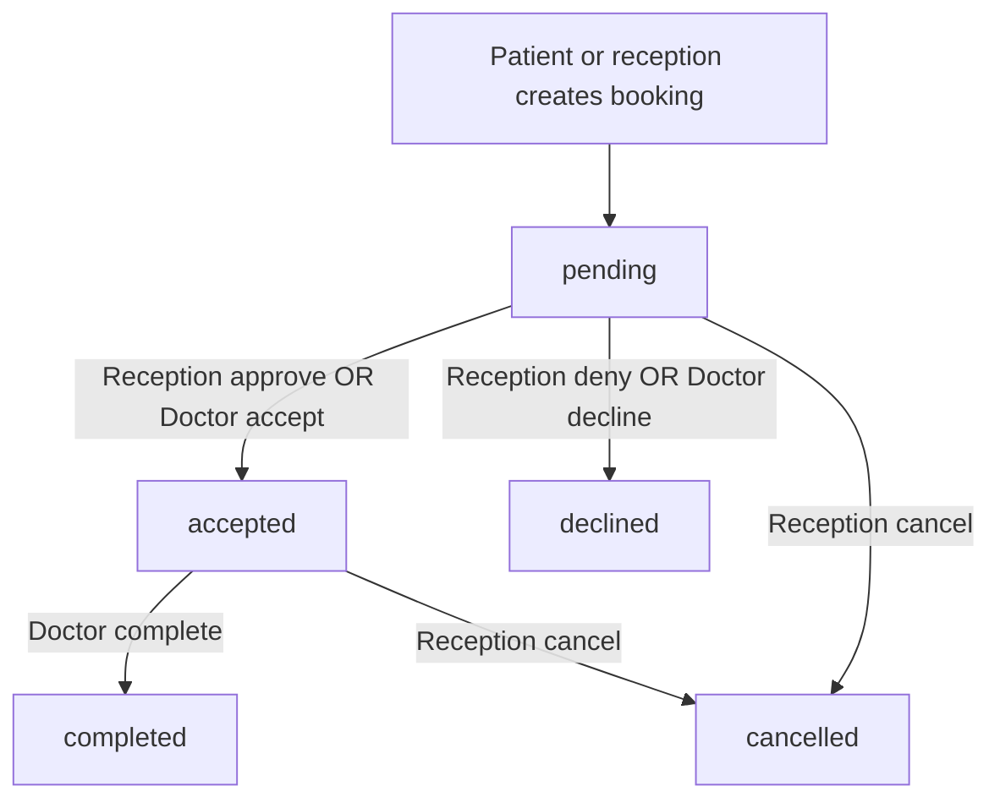

# Doctor, Reception & Patient — How They Interact

This document describes how **patients**, **reception staff**, and **doctors** work together in BMBookingIntegrated.

For API details and Postman examples, see also:

- [APPOINTMENT_GUIDE.md](guides/APPOINTMENT_GUIDE.md) — doctor appointments
- [PATIENT_APPOINTMENT_GUIDE.md](guides/PATIENT_APPOINTMENT_GUIDE.md) — patient booking and polling
- [reception/README.md](../apps/reception/README.md) — running the reception web app

---

## Who uses what

| Role | App | Auth | Main job |
|------|-----|------|----------|
| **Patient** | Mobile (Expo) | Phone OTP | Book doctor visits and lab/equipment; see status |
| **Doctor** | Mobile (Expo) | Phone OTP | Accept/decline requests, complete visits |
| **Receptionist** | Web (“BM Hub”) | Username + password | Hospital schedules, approve/deny bookings, walk-ins |
| **Admin** | Admin dashboard | Email + password | Doctor onboarding, payouts, hospitals |

All clinical data is scoped to a **hospital** (`DoctorProfile.hospitalId`, `ReceptionistProfile.hospitalId`).

---

## End-to-end: doctor appointment

### 1. Booking (patient or reception)

**Patient (mobile)**

1. Finds a doctor and books: `POST /api/appointments`
2. Appointment starts as **`pending`**
3. Patient is notified when status changes (accept/decline/complete)

**Reception (walk-in / desk booking)**

1. Creates booking: `POST /api/appointments/receptionist`
2. Also starts as **`pending`** — still needs approval (reception approve or doctor accept)

### 2. Triage — who approves?

“Triage” here means **accept or decline** a pending request. There is **no** clinical urgency/acuity or nurse triage module.

| Actor | Action | Result |
|-------|--------|--------|
| **Reception** | `PATCH /api/receptionist/appointments/:id/approve` | `accepted` + `reviewedByReceptionistId` set |
| **Reception** | `PATCH /api/receptionist/appointments/:id/deny` | `declined` + reason |
| **Doctor** | `PATCH /api/appointments/:id/accept` | `accepted` |
| **Doctor** | `PATCH /api/appointments/:id/decline` | `declined` + reason |

**Important:** Only one side should review a pending appointment.

- If **reception** already approved or denied, the doctor **cannot** accept/decline (`reviewedByReceptionistId` is set).
- Reception and doctor both move `pending` → `accepted`; the first successful review wins for that booking.

### 3. Visit complete

**Doctor:** `PATCH /api/appointments/:id/complete` → `completed`, wallet credit, patient notified.

Reception can also **cancel**, **reschedule**, and add **notes** on appointments (`/api/receptionist/appointments/*`).


---

## Reception web modules (BM Hub)

| Page | Purpose |
|------|---------|
| **Dashboard** | Hub / navigation |
| **Schedules** | CRUD doctor availability for the hospital |
| **Appointments** | List, filter, approve/deny, cancel, reschedule, notes, create walk-in |
| **Equipment** | Confirm/decline bookings, operational status, **bookings** |

Login: `POST /api/auth/receptionist-login` (see seed users in `backend/prisma/seed.js`, e.g. `receptionist_bl` / `password123` for Black Lion).

---

## Mobile apps

### Patient tabs

- Discover doctors, book appointments and equipment
- Track `pending` → `accepted` / `declined` / `completed`

### Doctor tabs

- **Schedule** — pending requests (accept/decline), complete visits

Routing is role-based in `mobile/app/_layout.tsx` (patient vs doctor stacks).

---

## Quick API map

Base URL: `PUBLIC_API_URL` (default `http://localhost:5000`)

| Actor | Doctor appointments | Equipment |
|-------|---------------------|-----------|
| Patient | `POST /api/appointments`, `GET /api/appointments/my` | `POST /api/equipment/book`, `GET /api/equipment/bookings` |
| Doctor | `PATCH /:id/accept\|decline\|complete` | — |
| Reception | `GET /api/receptionist/appointments`, `PATCH .../approve\|deny`, `POST /api/appointments/receptionist` | `PATCH .../confirm` |

---

## Running the stack locally

From repo root:

```bash
docker compose up
```

| Surface | URL |
|---------|-----|
| API | http://localhost:5000 |
| Reception | http://localhost:3001 |
| Mobile | `npm run dev:mobile` → http://localhost:8081 |

See [README.md](../README.md) for environment setup.

---

## Related files

| Area | Path |
|------|------|
| Data model | `backend/prisma/schema.prisma` |
| Reception UI | `reception/src/pages/AppointmentsPage.tsx`, `EquipmentPage.tsx` |
