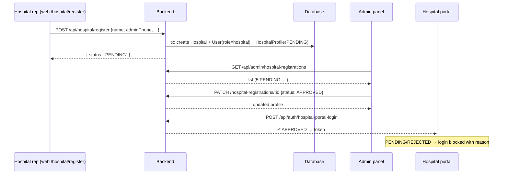
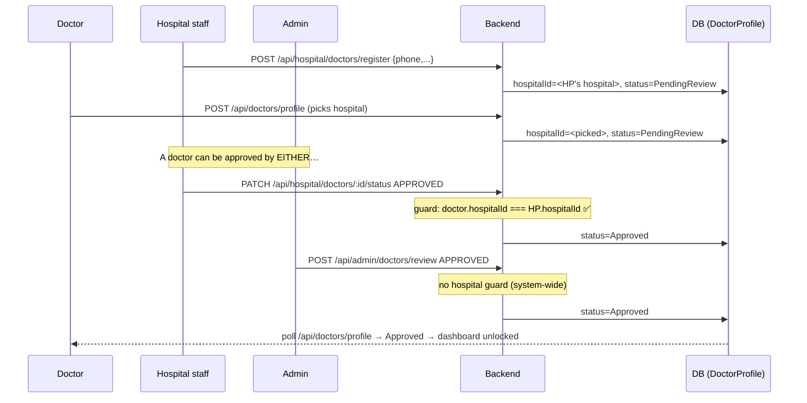

# 🏥 BM Booking — Hospital Registration & Doctor Approval Flow Details

> End-to-end explainer of how hospitals get registered and approved, how **doctors get approved based on the hospital they work at**, and what each dashboard does in each flow.
>
> Code references point to the actual source files so you can jump straight to the implementation.

---

## Table of contents
1. [Roles, statuses and data model](#1-roles-statuses-and-data-model)
2. [Flow 1 — Hospital registration & approval](#2-flow-1--hospital-registration--approval)
3. [Flow 2 — Doctor registration & approval (based on hospital)](#3-flow-2--doctor-registration--approval-based-on-hospital)
4. [Each dashboard explained](#4-each-dashboard-explained)
5. [API endpoint reference](#5-api-endpoint-reference)
6. [Deployed URLs & default accounts](#6-deployed-urls--default-accounts)

---

## 1. Roles, statuses and data model

### Roles (`Role` enum — `apps/backend/prisma/schema.prisma:11`)
| Role | Who it is | Logs in through |
|------|-----------|-----------------|
| `patient` | App users | mobile OTP |
| `doctor` | Doctors | mobile OTP |
| `receptionist` | Hospital staff (front-desk) | username/password — reception + hospital portal |
| `hospital` | Hospital owner (created at hospital registration) | username/phone + password — hospital portal |
| `admin` | Platform operator (approves hospitals & doctors) | email + password — admin panels |

### Hospital status (`HospitalProfileStatus` — `schema.prisma:19`)
```
PENDING  →  APPROVED
   │
   └──→  REJECTED  (rejectionReason required)
```
A hospital **cannot log in to the portal while PENDING or REJECTED**. The backend enforces this in every auth path (`apps/backend/src/services/auth.service.js` — `requestOTP`, `verifyOTP`, `loginHospital`, `loginHospitalPortal`).

### Doctor status (`DoctorStatus` — `schema.prisma:25`)
```
PendingReview  →  Approved
     │
     └──→  Rejected  (rejectionReason required)
```
Doctors start in `PendingReview` on **every** registration path. Only `Approved` doctors appear in public listings, get schedules, and can take patients (`Apps/backend/src/services/doctor.service.js:190`).

### Key relationships
- `HospitalProfile` links a `User` (role `hospital`) to a `Hospital` and carries the status → this is what an admin approves/rejects.
- `DoctorProfile.hospitalId` links a doctor to the `Hospital` they work at (`schema.prisma:172`). **This single field decides who may approve the doctor.**
- `ReceptionistProfile.hospitalId` links staff to their hospital (`schema.prisma:134`).

```
User(role=hospital) ──── HospitalProfile (PENDING/APPROVED/REJECTED) ──── Hospital
User(role=doctor)   ──── DoctorProfile (PendingReview/Approved/Rejected) ─ Hospital (hospitalId)
User(role=receptionist) ─ ReceptionistProfile ──────────────────────────── Hospital (hospitalId) + permissions[]
```

---

## 2. Flow 1 — Hospital registration & approval

### 2.1 Who does what
| Step | Actor | Where | What happens |
|------|-------|-------|--------------|
| 1 | Hospital representative | Web `/hospital/register` or app | Submits the registration form |
| 2 | System | Backend | Creates `User(role=hospital)` + `Hospital` + `HospitalProfile PENDING` in one transaction |
| 3 | Admin | Admin panel → **Applied Hospitals** | Reviews the submission → **Approve** or **Reject (with reason)** |
| 4 | Hospital owner | Hospital portal | Logs in only **after `APPROVED`** |
| 5 | Hospital owner | Hospital portal | Adds doctors, receptionists, schedules, services, card price |

### 2.2 Registration (step 1–2)
- **Screen:** `apps/web/src/app/hospital/register/page.tsx` — fields: name, address, phone, email, admin phone, password, logo, and a checkbox list of services. It calls `registerHospital` (`apps/web/src/lib/store/slices/hospitalSlice.ts`) → `POST /api/hospital/register`.
- **Backend:** `HospitalPortalService.register` (`apps/backend/src/services/hospital-portal.service.js:15`) inside one `$transaction`:
  1. Rejects if hospital name or admin phone already exists.
  2. Creates `Hospital` (`cardPrice` starts at `0`).
  3. Creates `User` with `role: "hospital"` + hashed password.
  4. Creates `HospitalProfile` with `status: "PENDING"`.
- **Route:** `POST /api/hospital/register` (public) — `apps/backend/src/routes/hospital-portal.routes.js:16`.
- **Result:** hospital is invisible to patients, the owner **cannot log in yet**.

### 2.3 Admin approval (step 3)
- **Screen:** `/admin/applied-hospitals` — `apps/web/src/app/admin/applied-hospitals/page.tsx`. (The older admin panel at `:53400` has the same page at `/hospital-registrations`.)
- **API:**
  - List: `GET /api/admin/hospital-registrations` → `AdminHospitalController.listHospitalRegistrations` (`apps/backend/src/controllers/admin.hospital.controller.js:6`)
  - Approve: `PATCH /api/admin/hospital-registrations/:id` `{ "status": "APPROVED" }`
  - Reject: `PATCH ... { "status": "REJECTED", "rejectionReason": "..." }` (reason shown to the hospital)
- **Backend rule:** status must be `APPROVED` or `REJECTED`; if `REJECTED` the stored `rejectionReason` is kept, otherwise cleared (`admin.hospital.controller.js:26-58`).

### 2.4 Hospital login & gating (step 4)
- The hospital owner logs into the hospital portal at `/login` (web) with phone/username + password → `POST /api/auth/hospital-portal-login` (`auth.routes.js:30`).
- `loginHospitalPortal` (`apps/backend/src/services/auth.service.js:284`) resolves the account (owner **or** receptionist), then:
  - `status === "PENDING"` → error `"Your hospital registration is pending admin approval. Please try again later."`
  - `status === "REJECTED"` → error `"Your hospital registration was rejected: {reason}"`
- Every subsequent portal request is re-checked by `hospitalAccessMiddleware` (`apps/backend/src/middleware/hospital-access.middleware.js`).
- These exact messages are mapped to friendly UI screens in `apps/web/src/lib/store/slices/authSlice.ts`.

### 2.5 After approval (step 5)
The owner can now:
- Edit profile & set `cardPrice` (`PATCH /api/hospital/...`).
- **Register doctors** (→ `PendingReview`, then approve them — see Flow 2).
- Add receptionists (owner-only `staff.manage`), schedules, equipment, services.

### 2.6 Alternative: hospital application ("apply" waitlist)
There is a *separate, simpler* waitlist form tracked in its own table:
- `POST /api/hospital-applications` (public) → `HospitalApplication` with `status: PENDING`.
- Admin reviews in **Applied Hospitals** tab → `PATCH /api/hospital-applications/:id` (CONTACTED / APPROVED / REJECTED with notes).
- This is **not** the real portal registration — it is a lightweight "get in touch" list. The real registration is Flow 2.1–2.5 above.

### 2.7 Hospital registration — sequence


---

## 3. Flow 2 — Doctor registration & approval (based on hospital)

### The core idea
> **A doctor is linked to a hospital (`DoctorProfile.hospitalId`), and that hospital's staff can only approve/reject doctors who belong to THEIR hospital.** The system-wide admin can approve *any* doctor. A doctor can be created in two ways, but both always land in `PendingReview` first.

### Two ways a doctor gets created

#### Path A — Hospital staff creates the doctor (reception/hospital portal)
1. **Who:** hospital owner or receptionist (requires `doctors.register` permission).
2. **Where:** Hospital portal → Doctors → Register Doctor (`apps/web/src/app/hospital/doctors/page.tsx`) **or** reception app Doctors page (`apps/reception/src/pages/DoctorsPage.tsx`).
3. **Backend:** `POST /api/hospital/doctors/register` (portal) or `POST /api/receptionist/doctors/register` (reception) → `ReceptionistService.registerDoctor` (`apps/backend/src/services/receptionist.service.js:1161`):
   - Creates `User(role=doctor)` + `DoctorProfile` with **`hospitalId = <their own hospital>`** and `status: "PendingReview"`.
   - Generates a temporary password (`A1!` suffix); the doctor can then log in with phone + temp password.
   - Reception app shows the status badge and `"Status: Pending Review — awaiting admin approval."`

#### Path B — Doctor self-onboarding (mobile app / web)
1. **Who:** the doctor themself.
2. **Where:** mobile `(doctor-onboarding)/setup` wizard (`apps/mobile/app/(doctor-onboarding)/setup.tsx`) — Step 1 professional info, Step 2 photo + intro video, Step 3 availability with a **hospital picker**.
3. **Backend:** `POST /api/doctors/profile` → `DoctorService.setupProfile` (`apps/backend/src/services/doctor.service.js:129`):
   - If no explicit `hospitalId`, it is **derived from the first availability slot's hospital**, or from a matching `clinicName`.
   - `Doctor.createProfile` sets `status: 'PendingReview'` (`apps/backend/src/models/doctor.model.js:19`).
   - `PendingReview` doctors are allowed through the payment middleware so they can finish their profile (`apps/backend/src/middleware/payment.middleware.js:29`).
4. The mobile app immediately switches to the `(doctor-onboarding)/pending` screen and **polls every 15s** (`startProfilePolling`) until the status changes.

### Who approves the doctor — the hospital matters
| Approver | Where | Can approve | Guard |
|----------|-------|-------------|-------|
| **Admin** | Admin panel → Doctors → Pending | Any doctor, from any hospital | role `admin` |
| **Hospital owner/staff** | Hospital portal → Doctors → Pending | **Only doctors whose `hospitalId` equals their own hospital** | `doctor.hospitalId !== hospitalId` → error `"Doctor does not belong to this hospital"` |

**Endpoints:**
- Admin approve: `POST /api/admin/doctors/review` `{doctorId, status, rejectionReason}` → `AdminService.updateDoctorStatus` (`apps/backend/src/services/admin.service.js:361`). There is **no** hospital-belonging check here (system-wide power).
- Hospital approve: `PATCH /api/hospital/doctors/:id/status` (permission `doctors.manage`) → `HospitalPortalService.updateDoctorStatus` (`apps/backend/src/services/hospital-portal.service.js:578`), **or** `PATCH /api/hospital/doctors/:id/review` / `PATCH /api/receptionist/doctors/:id/review` → `ReceptionistService.reviewHospitalDoctor` (`receptionist.service.js:1128`).

Both hospital-side versions enforce:
1. Only `Approved` / `Rejected` allowed.
2. `doctor.hospitalId === my hospitalId` (❗ the "based on the hospital they work at" rule).
3. Only currently-`PendingReview` doctors can be actioned.
4. Rejection requires a reason.

### What changes after a doctor is Approved
- The doctor appears in patient-facing doctor/hospital listings (`getAllDoctors` filters `status: 'Approved'` — `apps/backend/src/services/doctor.service.js:190`).
- The doctor can set schedules/availability, add a payout method (for the consultation fee), and start receiving appointments.
- The mobile app auto-redirects them from the "Under Review" screen to the doctor dashboard (`apps/mobile/app/(doctor-onboarding)/pending.tsx`).

### What happens on Rejection
- `rejectionReason` is stored and shown back to the doctor (pending banner / rejection banner in mobile `(doctor-onboarding)/setup.tsx`, web `/doctor/onboarding`).
- Doctor remains unable to appear in listings until re-approved (there is no public re-submit status; an admin/hospital must set it back to Approved or the profile is edited and resubmitted).

### Doctor flow — sequence


---

## 4. Each dashboard explained

### 4.1 Admin dashboard
> Web app: `/admin` (`apps/web/src/app/admin/**`), port **53411**. Legacy dedicated panel: `:53400` (`apps/admin-dashboard`).

| Section | Route | What it does |
|---------|-------|--------------|
| Dashboard / Analysis | `/admin`, `/admin/analysis` | KPIs: patients, doctors, appointments, revenue, active patients, growth |
| **Applied Hospitals** | `/admin/applied-hospitals` | **Hospital registration approval**: list `hospital-registrations`, Approve / Reject-with-reason |
| Hospitals | `/admin/hospitals` | Manage approved hospitals: create/edit/delete, receptionists CRUD, service fee |
| Medical Tools | `/admin/medical-tools` | Equipment items + announcements per hospital |
| Doctors | `/admin/doctors` | **Doctor approval**: Pending / All tabs, Approve / Reject-with-reason, assign to hospital, create doctor, schedules |
| Doctor profile | `/admin/doctor-profile/[id]` | Overview, reviews, appointment history |
| Reviews | `/admin/reviews` | Doctor/hospital reviews moderation |
| Patients | `/admin/patients` | Patient list + history |
| Announcements | `/admin/announcements` | Create/publish/push notifications |
| Payouts | `/admin/payouts` | Doctor withdrawal requests + receipt upload |
| Settings | `/admin/settings` | App service fee |

**In these flows specifically:** the admin decides the fate of every hospital registration AND every doctor (regardless of hospital).

### 4.2 Hospital portal dashboard
> Web app: `/hospital` (`apps/web/src/app/hospital/**`), port **53411**. Logged in via hospital-portal-login (owner or receptionist). Permissions gate each nav item (`apps/web/src/app/hospital/layout.tsx`).

| Section | Route | Who | What it does |
|---------|-------|-----|--------------|
| Overview | `/hospital` | all | Stats: doctors, pending doctors, receptionists, appointments |
| **Doctors** | `/hospital/doctors` | `doctors.view`+ | **Register doctors & approve/reject PENDING doctors that belong to this hospital**. Tabs Pending/Approved/Rejected, reject modal with reason |
| Receptionists / Staff | `/hospital/staff` | owner | Create/remove receptionists & assign permissions |
| Patients | `/hospital/patients` | view | Patient directory |
| Schedule / Appointments | `/hospital/schedules` | view | Manage schedules, calendar |
| Equipment | `/hospital/equipment` | view | Hospital equipment list + bookings |
| Analysis | `/hospital/analysis` | view | Hospital KPIs |
| Settings | `/hospital/settings` | `settings.edit` | Profile, card price, services, legal |

**In these flows specifically:** the hospital owner/staff are the frontline for doctor approval — they approve/reject the doctors *working at their hospital*.

### 4.3 Reception dashboard
> Separate app `apps/reception`, port **53401**. Front-desk staff (username/password).
- **Doctors page** (`/doctors`): registers doctors (multipart photo + intro video) → creates `PendingReview`, updates/removes doctors. The approval *buttons* are intentionally not exposed here — approval is done by the **hospital portal page or the admin**.
- Other pages: `/` dashboard, `/schedules`, `/appointments`, `/patients`, `/equipment`, `/hospital` (settings/card price), `/notifications`, `/legal`.

### 4.4 Doctor mobile app
> `apps/mobile` — status-driven routing in `app/_layout.tsx`:
- **No profile** → onboarding wizard `(doctor-onboarding)/setup` (picks hospital in the availability step).
- **`PendingReview`** → `(doctor-onboarding)/pending` — "Under Review" + 15s auto-poll until status flips.
- **`Rejected`** → back to setup with a red rejection banner (shows `rejectionReason`).
- **`Approved`** → `(doctor-tabs)`: Dashboard, Appointments, Schedule, Profile (hidden tabs: wallet, edit professional, availability).

### 4.5 (Context) Patient app
Patients never see PENDING/REJECTED hospitals or doctors — only `Approved` doctors and accepted hospitals appear in search/listings.

---

## 5. API endpoint reference

### Hospital registration & approval
| Method | Endpoint | Auth | Purpose |
|--------|----------|------|---------|
| POST | `/api/hospital/register` | public | Self-service hospital registration → `PENDING` |
| POST | `/api/hospital-applications` | public | Lightweight "apply" waitlist form |
| GET | `/api/admin/hospital-registrations` | admin | List hospital portal registrations (`?status=`) |
| PATCH | `/api/admin/hospital-registrations/:id` | admin | Approve / Reject hospital |
| GET | `/api/admin/hospital-applications` | admin | List waitlist applications |
| PATCH | `/api/admin/hospital-applications/:id` | admin | Update application status/notes |

### Auth (with hospital status guard)
| Method | Endpoint | Purpose |
|--------|----------|---------|
| POST | `/api/auth/hospital-portal-login` | Owner + receptionist portal login (blocked while PENDING/REJECTED) |
| POST | `/api/auth/hospital-login` | Hospital login (mobile/web; same guard) |
| POST | `/api/auth/receptionist-login` | Reception app login |

### Doctor registration & approval
| Method | Endpoint | Auth / permission | Purpose |
|--------|----------|-------------------|---------|
| POST | `/api/doctors/profile` | doctor | Self-onboarding → `PendingReview` |
| GET | `/api/doctors/profile` | doctor | Status + profile (used for polling) |
| POST | `/api/hospital/doctors/register` | hospital `doctors.register` | Staff creates doctor → `PendingReview` (hospitalId = own) |
| POST | `/api/receptionist/doctors/register` | receptionist | Same, from reception app |
| PATCH | `/api/hospital/doctors/:id/status` | hospital `doctors.manage` | Approve/Reject **own hospital's** doctor |
| PATCH | `/api/hospital/doctors/:id/review` | hospital `doctors.manage` | Approve/Reject **own hospital's** doctor |
| PATCH | `/api/receptionist/doctors/:id/review` | receptionist | Approve/Reject **own hospital's** doctor |
| POST | `/api/admin/doctors/review` | admin | Approve/Reject **any** doctor |
| GET | `/api/admin/doctors/pending` | admin | Pending doctors list |
| GET | `/api/admin/doctors` | admin | All doctors (filterable) |
| PUT | `/api/admin/doctors/:id/assign-hospital` | admin | Re-assign which hospital a doctor belongs to |

---

## 6. Deployed URLs & default accounts
> From `deploy-vps.sh` (server `77.42.25.202`)

| Service | URL / Port |
|---------|------------|
| Web + admin + hospital portal | http://77.42.25.202:53411 |
| Legacy admin dashboard | http://77.42.25.202:53400 |
| Reception | http://77.42.25.202:53401 |
| Backend API | http://77.42.25.202:52400 |

| Account | Credentials | Lifecycle |
|---------|-------------|-----------|
| Admin | `admin@bm-booking.com` / *(reserved, changed on 2026-09-22)* | Approves hospitals + any doctor |
| Hospital (seed) | `+251988223344` / `password123` | Portal owner; approves its own doctors |
| Receptionist (seed) | `selam` / `password123` | Staff; registers doctors, no approval |
| Doctor (seed) | `+251923456788` / `password123` | Mobile app |

---

## Appendix — Code map

| Concern | File(s) |
|---------|---------|
| Roles / statuses / models | `apps/backend/prisma/schema.prisma` |
| Hospital self-registration | `apps/backend/src/services/hospital-portal.service.js:15` |
| Hospital approval (admin) | `apps/backend/src/controllers/admin.hospital.controller.js:6` |
| Hospital login guard | `apps/backend/src/services/auth.service.js:284`, `middleware/hospital-access.middleware.js` |
| Doctor created by hospital | `apps/backend/src/services/receptionist.service.js:1161` |
| Doctor self-onboarding | `apps/backend/src/services/doctor.service.js:129`, `models/doctor.model.js` |
| Hospital approves its doctors | `apps/backend/src/services/hospital-portal.service.js:578`, `receptionist.service.js:1128` |
| Admin approves doctors | `apps/backend/src/services/admin.service.js:361` |
| Admin web pages | `apps/web/src/app/admin/{applied-hospitals,hospitals,doctors}/page.tsx` |
| Hospital web pages | `apps/web/src/app/hospital/{doctors,register}/page.tsx` |
| Doctor web onboarding | `apps/web/src/app/doctor/{onboarding,pending}/page.tsx` |
| Mobile doctor onboarding | `apps/mobile/app/(doctor-onboarding)/{setup,pending}.tsx` |
| Legacy admin panel | `apps/admin-dashboard/src/pages/{DashboardPage,HospitalRegistrationsPage}.tsx` |
| Reception app | `apps/reception/src/pages/DoctorsPage.tsx` |