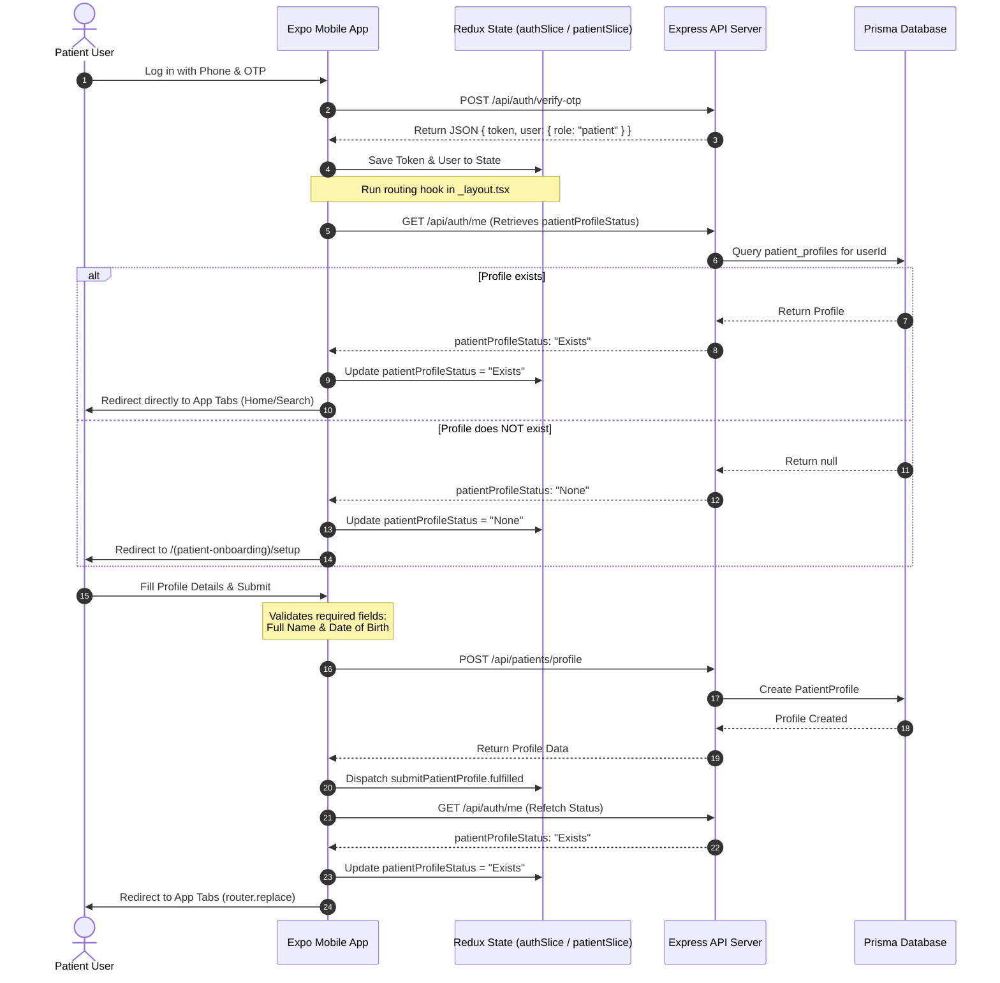

# 🏥 Patient Onboarding Flow & Design Specification

This document details the **Patient Onboarding Flow**, integrating our technical architecture with premium visual guidelines. It defines the routing logic, database structures, and API details, combined with **Telegram-inspired** structural layouts, **Claude.ai-style** high-trust "Paper & Ink" aesthetics, and **Duolingo-style** physics to ensure a delightful, low-friction entry.

---

## 🎨 1. Global Visual & Physics Configuration

### Design Token Application
*   **Background Canvas:** Absolute lock to `#F9F7F2` (Warm Paper).
*   **Input & Card Blocks:** Pure flat white `#FFFFFF` fields with refined `1px solid #E4E7EC` borders. No heavy, muddy drop-shadows.
*   **Typography Accent:** Primary titles and heavy headers use Deep Charcoal (`#1A1A1A`) with tight tracking for a premium clinical print feel.
*   **Status Accent:** Clinical emerald (`#027A48`) for successful verification, validation states, and completed steps.

### Fluid Spring Settings
To create a tactile, premium environment, page transitions, card slides, and modal popups discard rigid linear timers in favor of organic micro-physics.

```json
{
  "spring_type": "patient_fluid",
  "mass": 1.0,
  "stiffness": 200.0,
  "damping": 15.0
}
```

---

## 🗺️ 2. High-Level User Flow & Routing Mechanics

When a user logs in, the system determines whether they are a new or existing patient, routes them appropriately, collects health-related profile information, and completes their registration.



---

## 🎬 3. Onboarding Micro-Interactions & Motion Choreography

### Step 1: The Invisible Gate (Routing Mechanics)
* **The Scenario:** The `_layout.tsx` hook evaluates `patientProfileStatus`.
* **Profile Exists ("Exists"):** The login interface scales up slightly and cross-fades directly out into the main application tabs canvas smoothly (`opacity: 0` to `1` over a swift $250\text{ms}$ layout transition).
* **Profile Missing ("None"):** The login container glides smoothly to the left side of the screen (`translateX: -100%`), pulling the profile setup workspace in from the right viewport boundary (`translateX: 100% ➔ 0%`).

### Step 2: The Patient Setup Form `(patient-onboarding)/setup.tsx`
The form fields utilize reactive physics layers to keep data input highly encouraging.

```
+-------------------------------------------------------+
|  [x] Complete Profile Setup                (40% [██░░])|
+-------------------------------------------------------+
|  Your Information                                     |
|                                                       |
|  Full Name                                            |
|  [ Sara Tesfaye                  | ]  ✓ (Fade-In)    |
|                                                       |
|  Blood Type                                           |
|  ( O+ )  [ A+ ]  [ B+ ]  [ AB+ ]  <- Liquid Snap Fill |
+-------------------------------------------------------+
```

#### A. Interactive Input Field Focus
* When a patient taps into fields like **Full Name**, the background color stays pure `#FFFFFF` while the border shifts seamlessly into a sharp `1px solid #1A1A1A` ring via a quick scale wave pulse ($1.0\times \rightarrow 1.02\times \rightarrow 1.0\times$).
* **Inline Verification:** As soon as required items satisfy validation rules (e.g., text entered in Full Name, Date selected), an elegant clinical emerald (`#027A48`) validation checkmark animates inline using an SVG stroke draw effect.

#### B. Segmented Chips Selector (Gender & Blood Type)
* Tapping an option chip (e.g., choosing **"Female"** or **"O+"**) triggers a **"Liquid Glass" fill motion**.
* The selection indicator doesn't just snap; it morphs and flows like a drop of ink expanding outwards to fill the capsule chip boundaries with solid `#1A1A1A`, text reversing to stark paper-white.

#### C. Floating Validation Alerts
* If the user hits submit while mandatory inputs are blank, the form layout engine locks. Missing containers instantly perform a quick horizontal tracking shake effect (`[-6px, 6px, -3px, 3px, 0]`) backed by an inline red warning label that rolls down smoothly from underneath the input box.

### Step 3: Profile Submission Celebration
When the async thunk `submitPatientProfile` reports success, a high-velocity celebration flow rewards the patient for completing their profile setup.

```
       [⚡] Data Syncing... (Refetch Status)
                  ↓
       [🎁] +100 PTS Onboarding Bonus!
                  ↓
  [ router.replace("/(tabs)") Horizontal Push ]
```

1. **The "Payoff" Point Pop:**
   * As the request clears, a Duolingo-inspired reward pill reading **`+100 PTS`** springs vertically out from the "Complete Profile" submit action button.
   * The badge uses a lightweight particle trajectory matrix mimicking low-gravity suspension:
     ```json
     {
       "trajectory": "vertical_axis",
       "initial_velocity_y": -12.0,
       "gravity_coefficient": 0.25,
       "scale_peak": 1.2
     }
     ```
   * It arcs smoothly upward, expands, and then floatingly vanishes directly into the top area of the application interface, accompanied by an iOS **Light/Impact** haptic bump.
2. **The Final Tab Switch:**
   * The setup container collapses downward safely into the bottom deck of the viewport layout (`translateY: 100%`).
   * Simultaneously, the home tab interface of the medical dashboard glides forward, opening up clean workspace clarity for searching and scheduling clinics.

---

## 🗄️ 4. Database Schema & Models

The backend utilizes a one-to-one relationship between the core `User` model and the `PatientProfile` model in the PostgreSQL database.

```prisma
model User {
  id             Int             @id @default(autoincrement())
  phone          String          @unique
  email          String?         @unique
  password       String
  role           String          // 'patient' | 'doctor' | 'admin' | 'receptionist'
  patientProfile PatientProfile?
  createdAt      DateTime        @default(now()) @map("created_at")
  updatedAt      DateTime        @updatedAt @map("updated_at")

  @@map("users")
}

model PatientProfile {
  id               Int           @id @default(autoincrement())
  userId           Int           @unique @map("user_id")
  user             User          @relation(fields: [userId], references: [id], onDelete: Cascade)
  fullName         String        @map("full_name")
  dateOfBirth      DateTime      @map("date_of_birth")
  gender           String
  bloodType        String?       @map("blood_type")
  emergencyContact String?       @map("emergency_contact")
  createdAt        DateTime      @default(now()) @map("created_at")
  updatedAt        DateTime      @updatedAt @map("updated_at")

  @@map("patient_profiles")
}
```

---

## 📡 5. API Specifications

Both onboarding endpoints require a valid JWT token passed in the `Authorization` header.

### A. Retrieve Patient Profile
* **Endpoint:** `GET /api/patients/profile`
* **Controller:** `PatientController.getProfile`
* **Response (Success - 200 OK):**
  ```json
  {
    "status": "success",
    "data": {
      "id": 12,
      "userId": 4,
      "fullName": "Sara Tesfaye",
      "dateOfBirth": "1995-04-12T00:00:00.000Z",
      "gender": "Female",
      "bloodType": "O+",
      "emergencyContact": "+251911223344"
    }
  }
  ```
* **Response (Not Found - 404):**
  ```json
  {
    "status": "fail",
    "message": "Patient profile not found"
  }
  ```

### B. Create/Update Patient Profile
* **Endpoint:** `POST /api/patients/profile`
* **Controller:** `PatientController.setupProfile`
* **Request Body:**
  ```json
  {
    "fullName": "Sara Tesfaye",
    "dateOfBirth": "1995-04-12",
    "gender": "Female",
    "bloodType": "O+",
    "emergencyContact": "+251911223344"
  }
  ```
* **Response (Success - 200 OK):**
  ```json
  {
    "status": "success",
    "data": {
      "id": 12,
      "userId": 4,
      "fullName": "Sara Tesfaye",
      "dateOfBirth": "1995-04-12T00:00:00.000Z",
      "gender": "Female",
      "bloodType": "O+",
      "emergencyContact": "+251911223344"
    }
  }
  ```

---

## ⚙️ 6. Mobile Client Routing & State Management

The flow is governed dynamically by React Native's `expo-router` using the auth slices.

### 🔄 The Routing Hook (`mobile/app/_layout.tsx`)
A `useEffect` hook monitors authorization state, user role, and profile status to auto-direct the user:

```typescript
if (user.role === "patient") {
  const inPatientTabs = currentSegment === "(tabs)";
  const inPatientOnboarding = currentSegment === "(patient-onboarding)";
  const inAllowedPages = currentSegment === "doctor" || currentSegment === "modal" || currentSegment === "doctor-list" || currentSegment === "item-detail";

  if (patientProfileStatus === "None") {
    if (!inPatientOnboarding) {
      router.replace("/(patient-onboarding)/setup");
    }
  } else {
    if (!inPatientTabs && !inAllowedPages) {
      router.replace("/(tabs)");
    }
  }
}
```

### 📝 Profile Setup Form (`mobile/app/(patient-onboarding)/setup.tsx`)
The onboarding screen presents a user-friendly form with client-side validation:
1. **Form Verification:**
   * Enforces `fullName` and `dateOfBirth` as mandatory.
   * Prompts the user using local error states `localError`.
2. **Submission:**
   * Formats the date of birth to `YYYY-MM-DD`.
   * Automatically prefixes phone input with local code `+251`.
   * Dispatches `submitPatientProfile` async thunk.
   * Dispatches `fetchPatientProfileStatus` on success, which updates `patientProfileStatus` to `"Exists"`, triggering routing redirect.
3. **Safety Options:**
   * If a user wishes to cancel or switch accounts, they can log out directly from the top-right button, resetting the session cleanly.

---

## 🖥️ 7. Engineering Implementation Matrix

| Module UI Component | Micro-Interaction Concept | Frame-Rate / Thread Layer | Haptic Track |
| :--- | :--- | :--- | :--- |
| **Form Entry Focus** | Scaled bounding box interpolation | Native Main Thread Layer | None |
| **Blood Type Chip Selection** | Liquid morphing color fill expansion | Native Layer / Reanimated | Light Tap Pulse |
| **Error Alert Shaking** | Horizontal transform cycle (`[-6px, 0]`) | Native Main Thread Layer | Selection Change |
| **Onboarding Reward Burst** | Particle trajectory emission loop | Hardware Accelerated Canvas | Success Notification |
