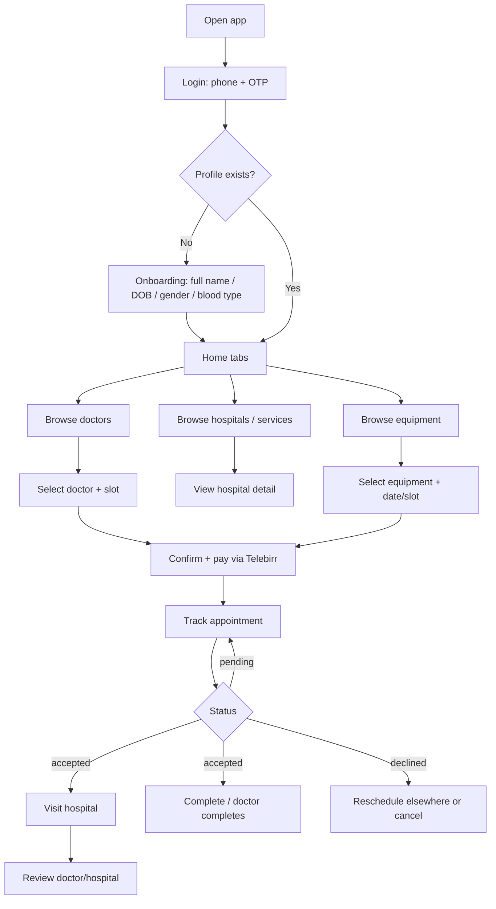

# Patient Side — Quick Flow & Documentation Index

Quick reference for the **patient journey** in BM Booking (mobile app `apps/mobile`).

---

## 1. The patient journey (end-to-end)

---

## 2. Step-by-step

| # | Step | Screen | API |
|---|------|--------|-----|
| 1 | Request OTP | Login | `POST /api/auth/request-otp` |
| 2 | Verify OTP (auto-login) | Login | `POST /api/auth/verify-otp` |
| 3 | Check role/profile status (routing in `mobile/app/_layout.tsx`) | — | `GET /api/auth/me` |
| 4 | Complete profile if new | `(patient-onboarding)/setup.tsx` | `POST /api/patients/profile` |
| 5 | Browse home / search | `(tabs)/index`, `(tabs)/doctors` | `GET /api/doctors/all`, `GET /api/doctors/search` |
| 6 | Hospitals + services | `(tabs)/hospitals` (or hospital detail) | `GET /api/hospitals`, `GET /api/hospitals/:id` |
| 7 | Equipment search | `(tabs)/equipment.tsx` | `GET /api/equipment/search`, `/api/equipment/categories`, `/api/equipment/announcements` |
| 8 | Equipment per hospital | `hospital-detail.tsx` | `GET /api/equipment/hospital/:id` |
| 9 | Equipment detail + availability | `item-detail.tsx` | `GET /api/equipment/detail/:id`, `GET /api/equipment/:id/availability?date=` |
| 10 | Book doctor appointment | booking flow | `POST /api/appointments` |
| 11 | Book equipment | booking flow | `POST /api/equipment/book` |
| 12 | Pay via Telebirr | modal | `POST /api/payments/verify-telebirr` (init via Telebirr H5) |
| 13 | My appointments (status + hospital address/phone + directions) | `(tabs)/appointments.tsx` | `GET /api/appointments/my` |
| 14 | My equipment bookings | `(tabs)/appointments.tsx` | `GET /api/equipment/bookings` |
| 15 | Cancel / reschedule | appointments | `PATCH /api/appointments/:id/cancel`, `PATCH /api/appointments/:id/reschedule`, `PATCH /api/equipment/bookings/:id/cancel|reschedule` |
| 16 | Review doctor / hospital after visit | appointments | `POST /api/reviews` (reviewed against the appointment) |
| 17 | Follow-up appointment | doctor portal | `POST /api/appointments/:id/follow-up` (doctor side) |

> Files: `mobile/app/(tabs)/`, `mobile/app/(patient-onboarding)/`, `mobile/app/hospital-detail.tsx`, `mobile/app/item-detail.tsx`, `mobile/app/modal.tsx`.
> State: `mobile/store/slices/{auth,patient,doctor,appointment,equipment,hospitalSlice}.ts`.

---

## 3. Appointment status flow

`pending` → (`accepted` | `declined`) → `completed` | `cancelled`

- Created: **pending** (notified on every change).
- Approved by reception OR accepted by doctor → `accepted` (first review wins).
- Reception deny / doctor decline → `declined` + reason.
- Doctor completes → `completed` (doctor wallet credited, patient notified).
- Patient cancels → `cancelled`. Rescheduling is allowed on pending/accepted.

---

## 4. Payment flow

1. Patient books appointment/equipment.
2. Checkout directs to **Telebirr H5**; after paying the patient returns to BM Booking.
3. App verifies with `POST /api/payments/verify-telebirr`.
4. Appointment becomes **paid** (`isPaid = true`); equipment booking created/confirmed; hospital card payments mark the card `isPaid`.

---

## 5. Documentation index (.md)

**Patient-specific**
- `apps/docs/PATIENT_SIDE_FLOW.md` — this file
- `apps/docs/guides/PATIENT_ONBOARDING_GUIDE.md` — onboarding walkthrough
- `apps/docs/guides/PATIENT_APPOINTMENT_GUIDE.md` — booking + polling
- `apps/docs/guides/OTP_LOGIN_GUIDE.md` — phone OTP login
- `apps/docs/guides/LOGIN_GUIDE.md` — all login flows
- `apps/docs/PATIENT_ONBOARDING_FLOW.md` — onboarding design spec (+ sequence diagram)
- `apps/docs/patient.md` / `apps/docs/backend/patient.md` — patient models/APIs
- `apps/docs/guides/APPOINTMENT_GUIDE.md` — appointment API guide
- `apps/docs/guides/REVIEWS_USER_GUIDE.md` / `DOCTOR_REVIEWS_GUIDE.md` — reviews
- `apps/docs/guides/MEDICAL_EQUIPMENT_GUIDE.md` — equipment user guide
- `apps/docs/guides/MEDICAL_EQUIPMENT_DEVELOPER_GUIDE.md` — equipment developer guide

**Architecture / roles**
- `apps/docs/DOCTOR_RECEPTION_PATIENT_README.md` — how the three roles interact
- `apps/docs/architecture/backend-architecture.md`
- `apps/docs/architecture/sequence-diagrams/patient/patientregistration.md`
- `apps/docs/architecture/sequence-diagrams/patient/patientlogin.md`
- `apps/docs/backend/registration.md`, `onboarding.md`, `doctor.md`, `admin.md`

**Mobile product**
- `apps/mobile/README.md`, `apps/mobile/PRODUCT.md`
- `apps/mobile/designs/medconnect_design_spec.md`

**Ops / infra**
- `apps/docs/DOCKER-NETWORKING.md`, `apps/docs/DNS-RECORDS.md`
- `apps/backend/TELEBIRR.md`, `apps/backend/README.md`
- `apps/docs/backend/NOTIFICATION_ARCHITECTURE.md`
- Legal: `apps/backend/legal/TERMS.md`, `apps/backend/legal/PRIVACY.md`