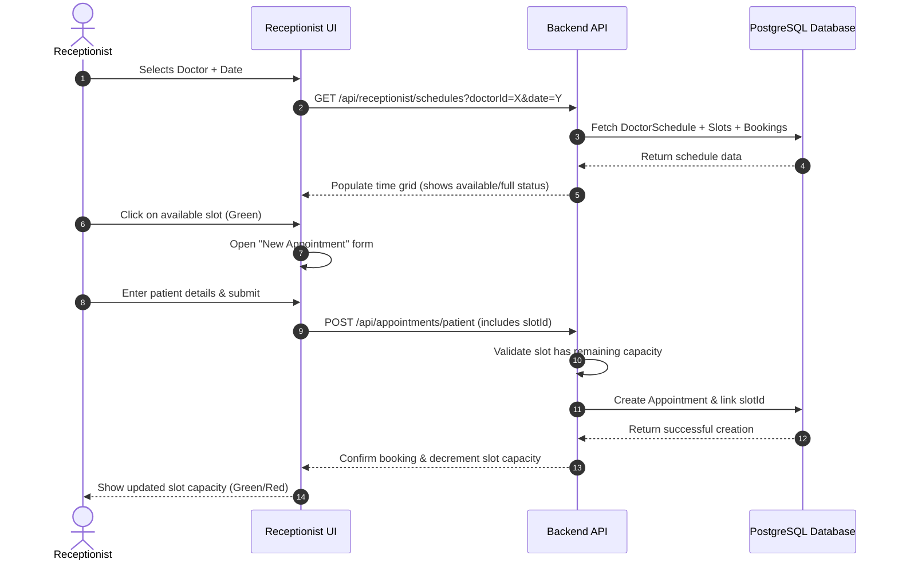

# Receptionist Appointment Calendar Specification & Workflow

This document describes how the **Receptionist Dashboard** visualizes, manages, and interacts with the doctor appointment calendar and booking slots.

---

## 1. Calendar Interface & Visual Layout

The calendar interface is structured as a two-column interactive layout designed for fast click actions and high readability.

### Layout Overview
```
+-----------------------------------------------------------------------------+
|  [Select Date Range]  < May 24 - May 31, 2026 >           [Search Doctors]  |
+------------------------------------+----------------------------------------+
|  DOCTORS LIST                      |  SELECTED DAY SCHEDULE & SLOTS         |
|  * Dr. Aaron Kebede (Cardiology)   |  Selected Date: Tuesday, May 26, 2026  |
|  * Dr. Bethlehem Tadesse (Peds)    |                                        |
|  * Dr. Yared Negash (Derm)         |  [ 09:00 AM - 10:00 AM ]  🟢 2 spots left|
|                                    |  [ 10:00 AM - 11:00 AM ]  🔴 FULL      |
|                                    |  [ 01:30 PM - 02:30 PM ]  🟢 4 spots left|
|                                    |  [ 03:00 PM - 04:00 PM ]  🟢 1 spot left |
+------------------------------------+----------------------------------------+
```

### Visual Slots State & Color Rules
Each time slot represents a defined `ScheduleSlot` entity, displaying state using color badges:

| Slot Status | Color Indicator | Label Display | Interaction |
| :--- | :--- | :--- | :--- |
| **Available** | 🟢 Green badge | `X spots left` (e.g., `3 spots left`) | Fully clickable, enables booking panel |
| **Fully Booked** | 🔴 Red badge | `FULL` | Disabled / Greys out, prevents double-booking |
| **Selected** | 🔵 Blue outline | Selected border highlight | Active slot targeted for the new appointment |

---

## 2. Receptionist Workflows

### Workflow A: Scheduling Walk-in Appointments
When a patient arrives at the clinic without a pre-booked appointment, the receptionist manually registers them:



---

## 3. Database Schema Mapping

The calendar relies on three primary database models configured in `prisma/schema.prisma`:

### `DoctorSchedule`
Defines a specific date range or single day a doctor is working.
* `id` (Int, Primary Key)
* `doctorId` (Int, Foreign Key)
* `date` (DateTime) - Stored as a midnight UTC timestamp.
* `isActive` (Boolean) - Toggles calendar visibility.

### `ScheduleSlot`
Defines an individual time window within a doctor's schedule day.
* `id` (Int, Primary Key)
* `scheduleId` (Int, Foreign Key)
* `startTime` (DateTime) - Storing boundary (e.g., `09:00 AM`).
* `endTime` (DateTime) - Ending boundary (e.g., `10:00 AM`).
* `maxPatients` (Int) - Maximum number of bookings allowed in this slot.

### `Appointment`
Links the patient to the specific scheduled slot.
* `id` (Int, Primary Key)
* `slotId` (Int, Foreign Key, Optional) - Links the booking directly to a `ScheduleSlot`.
* `status` (Enum: `pending`, `accepted`, `declined`, `completed`, `cancelled`)
