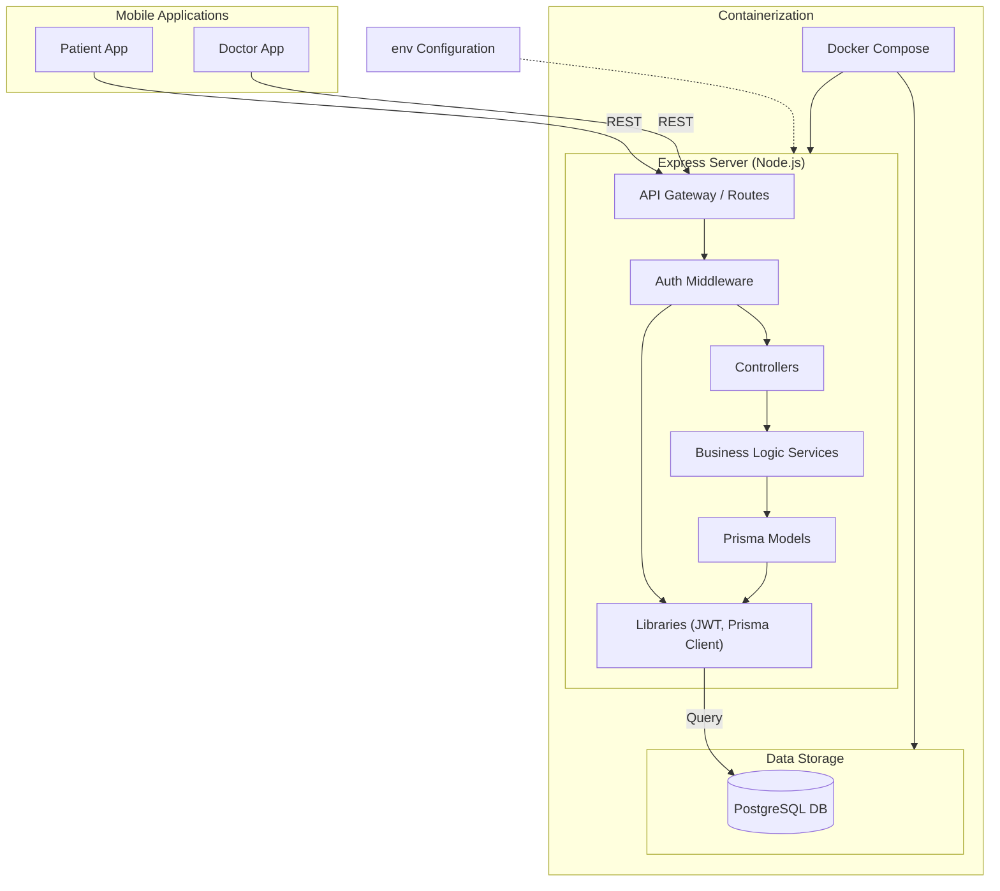
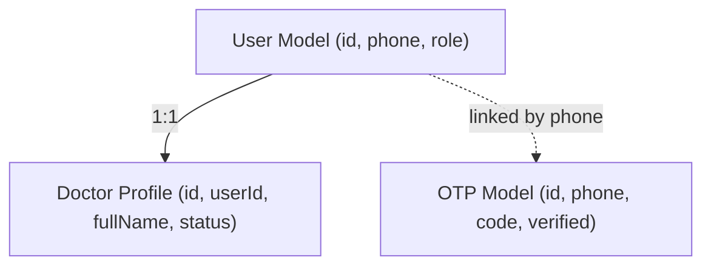
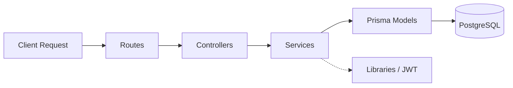

# BM Booking Backend Architecture

This document describes the high-level architecture of the BM Booking backend.

## System Overview

The backend is built using **Node.js** and **Express**, with **PostgreSQL** as the primary relational database. The entire environment is containerized using **Docker** for consistency across development and production.

### High-Level Diagram

## Data Model Interaction (ERD)

The following diagram shows how the database entities interact with each other via Prisma.

## Layered Model Interaction

This diagram shows how data flows through the modular architecture layers:

