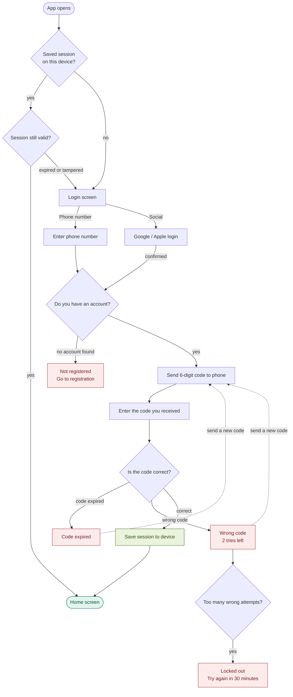

When login succeeds, you save a **long-lived token** on the device (stored securely, not just in memory). Every time the app opens, it checks for that token silently in the background — if it's valid, the user goes straight to the home screen. They never see the login screen again.

**Updated login flow:**

 We save session for 90 days