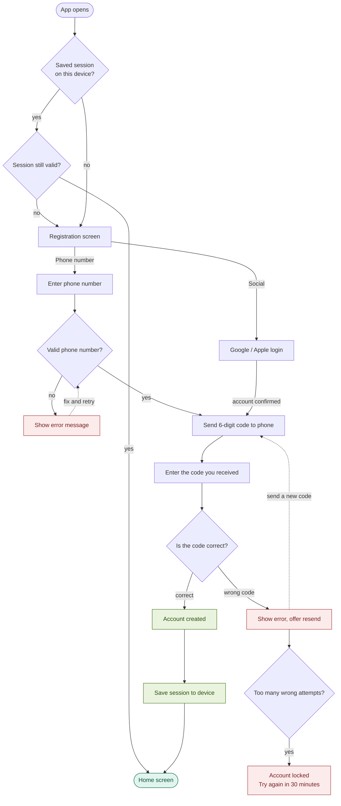

```mermaid
flowchart TD
    A([App opens]) --> B{Saved session\non this device?}

    B -->|yes| C{Session still valid?}
    C -->|yes| N([Home screen])
    C -->|no| D[Registration screen]

    B -->|no| D

    D -->|Phone number| E[Enter phone number]
    D -->|Social| F[Google / Apple login]

    E --> G{Valid phone number?}
    G -->|no| H[Show error message]
    H -.->|fix and retry| G

    G -->|yes| I[Send 6-digit code to phone]
    F -->|account confirmed| I

    I --> J[Enter the code you received]
    J --> K{Is the code correct?}

    K -->|wrong code| L[Show error, offer resend]
    L -.->|send a new code| I
    L --> M{Too many wrong attempts?}
    M -->|yes| O[Account locked\nTry again in 30 minutes]

    K -->|correct| P[Account created]
    P --> Q[Save session to device]
    Q --> N([Home screen])

    style P fill:#EAF3DE,stroke:#3B6D11,color:#27500A
    style Q fill:#EAF3DE,stroke:#3B6D11,color:#27500A
    style N fill:#E1F5EE,stroke:#0F6E56,color:#085041
    style O fill:#FCEBEB,stroke:#A32D2D,color:#791F1F
    style H fill:#FCEBEB,stroke:#A32D2D,color:#791F1F
    style L fill:#FCEBEB,stroke:#A32D2D,color:#791F1F
```

 