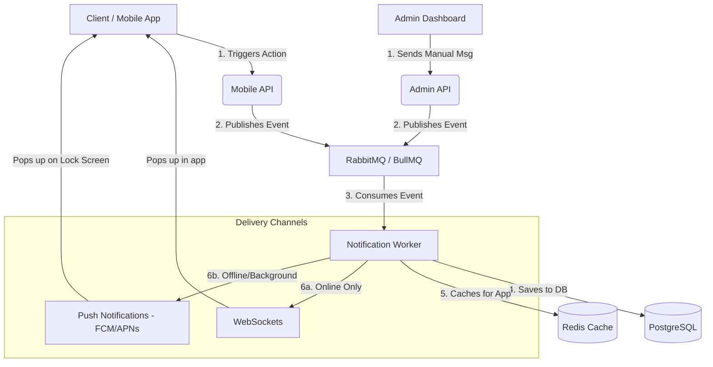

# Notification System Architecture: RabbitMQ + Redis + WebSockets

This document outlines the architectural design for the event-driven notification system in BM Booking. The goal is to build a decoupled, highly performant, and reliable notification pipeline.

## 1. High-Level Architecture

The system leverages three primary technologies to ensure notifications are never lost, processed quickly, and delivered in real-time.

1. **PostgreSQL**: The primary database. Stores the permanent history of all notifications.
2. **RabbitMQ**: The asynchronous message queue. It temporarily holds the event (like "appointment booked") until the system is ready to process it.
3. **Redis**: In-memory cache. Stores the most recent notifications for lightning-fast retrieval, and can act as a Pub/Sub mechanism to broadcast messages to WebSocket servers.
4. **WebSockets (Socket.io)**: Used strictly for real-time *delivery* to the client, pushing the notification to the app if the user is currently online.

### Component Diagram



## 2. Why Not Just WebSockets?

You might wonder: *"Why not just emit a WebSocket event directly from the API when the user books an appointment?"*

While WebSockets are great for *delivering* messages, they are not good at *managing* or *storing* them. 

**The Problem with Pure WebSockets:**
- **Lost Messages**: If the user's phone is offline or the app is closed, sending a WebSocket message fails. The notification is gone forever.
- **Slow APIs**: If the API has to generate a notification, save it to the database, and send a WebSocket event all during an HTTP request (like `POST /appointments`), the request takes much longer to respond.
- **Server Crashes**: If the backend crashes while trying to save the notification, the data is lost.

**The Solution (RabbitMQ + Redis + WebSockets):**
1. **RabbitMQ** acts as a safety net. The API just says "Hey, an appointment was booked" and throws it into the RabbitMQ queue. The API immediately responds to the user (making the app feel incredibly fast).
2. The **Notification Worker** picks up the message from RabbitMQ at its own pace. If the worker crashes, RabbitMQ keeps the message safe until the worker restarts.
3. The worker saves it to **Postgres** (so it's never lost) and **Redis** (so it loads instantly when the user opens their app).
4. *Finally*, the worker tells the **WebSocket** server to push it to the user. If they are offline, it doesn't matter! The notification is already safely waiting for them in the Redis cache the next time they open the app.

## 3. What is a "Notification Worker"?

A **Notification Worker** is simply a background script or process (like `notification.worker.js`) that runs constantly alongside your main API server. 

- **What it does NOT do**: It does not listen for HTTP requests from the mobile app.
- **What it DOES do**: It only listens to RabbitMQ. It waits for events to arrive in the queue, processes them (figures out what the notification title/body should be), saves them to the database and cache, and triggers the WebSocket. 
- By moving this heavy lifting to a background worker, your main API server is freed up to handle user requests instantly.

## 4. How a Notification Works (Step-by-Step Lifecycle)

Here is the clear lifecycle of how a notification gets to the user:

1. **The Trigger**: A user books an appointment on the mobile app. The app sends a request to the `BM Backend API`.
2. **The Event**: The API saves the appointment to PostgreSQL. Instead of generating a notification right then, the API simply creates a small message like `{"event": "booking", "userId": 123}` and drops it into **RabbitMQ**. The API tells the mobile app "Success!" immediately.
3. **The Queue**: RabbitMQ holds this message safely in its queue.
4. **The Worker**: The **Notification Worker** sees the new message in RabbitMQ and pulls it out.
5. **Processing**: The worker formats the notification: *"Your appointment is confirmed."*
6. **Storage (Permanent)**: The worker saves this formatted notification into **PostgreSQL**.
7. **Cache (Fast Storage)**: The worker adds the notification to a list in **Redis** (e.g., the user's top 50 unread notifications).
8. **Real-Time Push**: The worker tells the **WebSocket Server** to send a ping to the user's phone.
   - *If the user is online*: Their phone receives the WebSocket ping and shows a popup notification instantly.
   - *If the user is offline*: Nothing happens here, but the notification is safe.
9. **Fetching Missed Notifications**: When the user opens the BM Booking App later, the app calls `GET /api/notifications`. The API instantly grabs the unread notifications directly from **Redis** (which takes milliseconds) and displays them on the screen.

## 5. Data Structures & Schemas

### RabbitMQ Message Payload
```json
{
  "eventId": "uuid-1234",
  "eventType": "appointment_booked",
  "targetUserId": "user-uuid-5678",
  "payload": {
    "appointmentId": "apt-9999",
    "message": "Your appointment with Dr. Smith is confirmed."
  }
}
```

### PostgreSQL Schema (Prisma)
```prisma
model Notification {
  id        String   @id @default(uuid())
  userId    String
  user      User     @relation(fields: [userId], references: [id])
  type      String   // e.g., "APPOINTMENT"
  title     String
  message   String
  isRead    Boolean  @default(false)
  createdAt DateTime @default(now())
}
```

## 6. Handling Offline & Background Users

When a user's app is in the **background** or the phone is **locked**, WebSockets are disconnected. To reach them, the system uses **Push Notifications**:

1.  **Device Tokens**: When a user logs in, the mobile app gets a unique "Device Token" from Google/Apple and sends it to our API. We store this in the `User` table in PostgreSQL.
2.  **The Worker's Choice**: When the **Notification Worker** processes a message, it looks up the user's Device Token.
3.  **The Push**: The worker sends the message to **Firebase Cloud Messaging (FCM)**. 
4.  **System Delivery**: Google/Apple handles the delivery to the phone's operating system, which shows the popup even if the app is closed.

### The "Security Guard" (Operating System)
When the app is closed or in the background, it is "sleeping" and cannot receive data. However, the **Phone's Operating System (Android/iOS)** is always awake. 

The OS acts like a security guard for the app:
- It stays connected to Google/Apple servers.
- When a notification arrives, the **OS** (not the app) receives it and displays the popup.
- The app only "wakes up" once the user taps the notification.

## 7. Triggering from the Admin Panel

The Admin Panel works exactly like the Mobile API, but with a different trigger:

1.  **Admin Action**: An admin goes to the "Send Broadcast" page, types a message, and hits "Send".
2.  **Admin API**: The Admin API receives the request and immediately publishes a message to the **Queue** (RabbitMQ/BullMQ) with a type like `manual_broadcast`.
3.  **Same Pipeline**: From here, the **Notification Worker** takes over. It doesn't care if the message came from an automated system or a human admin—it just processes it, saves it to the database/cache, and pushes it to the user.

> [!TIP]
> **Why use the Queue for Admin messages?**
> If an admin sends a message to 10,000 users at once, sending those 10,000 notifications one-by-one in the Admin API would time out the browser. By using a Queue, the Admin API returns "Success" instantly, and the Worker processes those 10,000 messages safely in the background.

