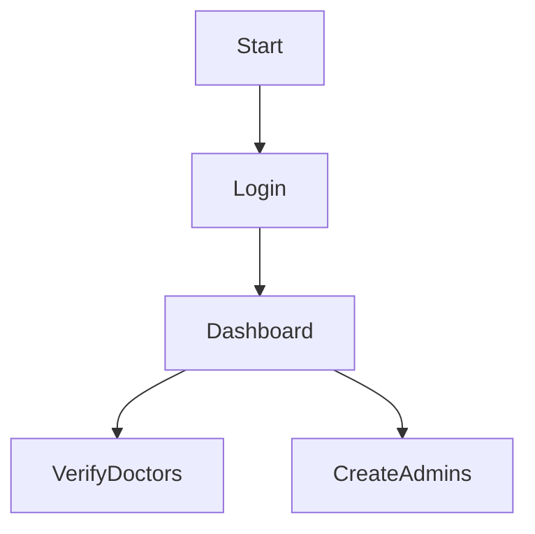

# 🛠 Admin Integration Guide

## 🚀 The Admin Journey



---

## 📡 API Reference

### 1. Admin Login
- **Endpoint**: `POST /api/admin/login`
- **✅ Success (200)**:
  ```json
  { "status": "success", "data": { "token": "JWT...", "user": { ... } } }
  ```
- **❌ Error (401)**:
  ```json
  { "status": "fail", "message": "Invalid email or password" }
  ```

### 2. Create New Admin
- **Endpoint**: `POST /api/admin/create`
- **Auth**: `Bearer <token>`
- **✅ Success (201)**:
  ```json
  { "status": "success", "data": { "email": "..." } }
  ```
- **❌ Error (403)**:
  ```json
  { "status": "fail", "message": "Access denied" }
  ```

### 3. Hospitals & receptionists
Full reference: [HOSPITAL_ADMIN_GUIDE.md](../guides/HOSPITAL_ADMIN_GUIDE.md)

| Method | Path | Notes |
|--------|------|--------|
| `GET` | `/api/admin/hospitals` | List with counts |
| `POST` | `/api/admin/hospitals` | `cardPrice` required (ETB) |
| `PUT` | `/api/admin/hospitals/:id` | Update hospital |
| `GET` | `/api/admin/receptionists` | List with hospital |
| `POST` | `/api/admin/receptionists` | `username`, `password`, `hospitalId` |
