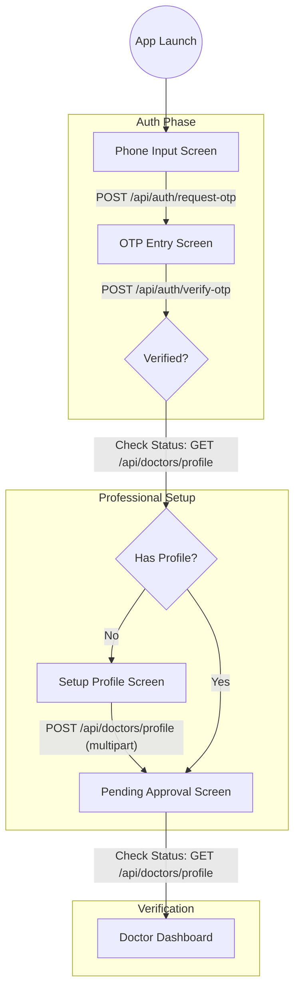

# 🩺 Doctor Integration Guide

This document is for the team building the **Doctor Mobile Application**.

---

## 🚀 The Doctor Journey



---

## 📡 API Reference

### 1. Authentication (OTP)
Doctors authenticate using their phone number. Use `role: "doctor"` in all authentication requests.

#### A. Request OTP
- **Endpoint**: `POST /api/auth/request-otp`
- **Body**: 
  ```json
  { 
    "phone": "+251912345678", 
    "role": "doctor",
    "isRegistration": true 
  }
  ```
- **✅ Success (200)**:
  ```json
  { "status": "success", "message": "OTP sent successfully" }
  ```
- **❌ Error (400)**:
  ```json
  { "status": "fail", "message": "This phone number is already registered. Please log in instead." }
  ```
- **❌ Error (400)**:
  ```json
  { "status": "fail", "message": "Validation Error: Phone number format is invalid" }
  ```

#### B. Verify OTP
- **Endpoint**: `POST /api/auth/verify-otp`
- **Body**: 
  ```json
  { 
    "phone": "+251912345678", 
    "code": "1234", 
    "role": "doctor",
    "isRegistration": true 
  }
  ```
- **✅ Success (200)**:
  ```json
  {
    "status": "success",
    "data": { 
      "token": "JWT_TOKEN_HERE", 
      "user": { "id": 1, "phone": "+2519...", "role": "doctor" } 
    }
  }
  ```
- **❌ Error (400/401/403)**:
  ```json
  { "status": "fail", "message": "Account exists with role 'patient'. You cannot register or log in as 'doctor'." }
  ```


### 2. Profile Setup (Multipart Form-Data)
- **Endpoint**: `POST /api/doctors/profile`
- **Headers**: `Content-Type: multipart/form-data`, `Authorization: Bearer <token>`
- **✅ Success (201)**:
  ```json
  { "status": "success", "message": "Profile created and pending review" }
  ```
- **❌ Error (400 - Validation Fail)**:
  ```json
  { "status": "fail", "message": "Validation Error: bio must be at least 10 chars, licenseNumber is required..." }
  ```
- **❌ Error (401 - Missing Token)**:
  ```json
  { "status": "fail", "message": "No token provided" }
  ```

### 3. Check Status / Get Profile
- **Endpoint**: `GET /api/doctors/profile`
- **Auth Required**: `Bearer <token>`
- **✅ Success (200)**:
  ```json
  {
    "status": "success",
    "data": { 
      "status": "PendingReview", 
      "fullName": "Dr. Smith", 
      "specialization": "...", 
      ... 
    }
  }
  ```
- **❌ Error (404 - Not Setup)**:
  ```json
  { "status": "fail", "message": "Doctor profile not found" }
  ```
