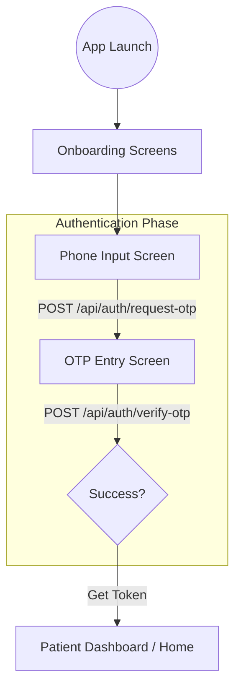

# 👤 Patient Integration Guide

This document is for the team building the **Patient Mobile Application**.

---

## 🚀 The Patient Journey



---

## 📡 API Reference

### 1. Request OTP
- **Endpoint**: `POST /api/auth/request-otp`
- **Body**: 
  ```json
  { "phone": "+251912345678", "role": "patient" }
  ```
- **✅ Success (200)**:
  ```json
  { "status": "success", "message": "OTP sent successfully" }
  ```
- **❌ Error (400 - Format Error)**:
  ```json
  { "status": "fail", "message": "Validation Error: Phone number must be a valid Ethiopian number (+251...)" }
  ```

### 2. Verify OTP
- **Endpoint**: `POST /api/auth/verify-otp`
- **Body**: 
  ```json
  { "phone": "+251912345678", "code": "1234", "role": "patient" }
  ```
- **✅ Success (200)**:
  ```json
  {
    "status": "success",
    "data": { 
      "token": "JWT_TOKEN_HERE", 
      "user": { "id": 1, "phone": "+2519...", "role": "patient" } 
    }
  }
  ```
- **❌ Error (401 - Code Incorrect)**:
  ```json
  { "status": "fail", "message": "Invalid or expired OTP" }
  ```
- **❌ Error (403 - Account Locked)**:
  ```json
  { "status": "fail", "message": "Account locked. Try again in 30 minutes" }
  ```
